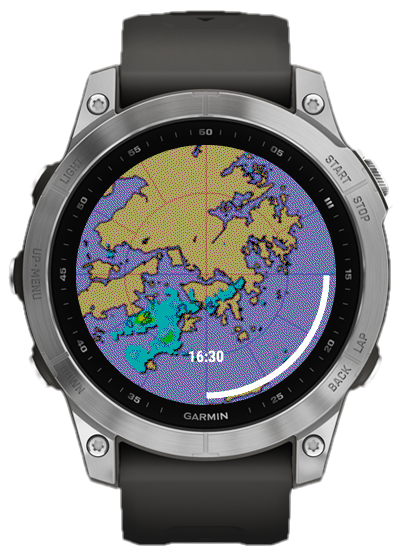

# HKO-Radar

This app obtains the list of latest radar images from the Hong Kong Observatory internal API, then request them 1 by 1 starting from the latest. Results are displayed as a looping sequential animation.

Radar image selected is the 64km-range version, which is then scaled 2x and cropped centrally.

Pressing Start/Stop will Pause/Unpause the animation.
