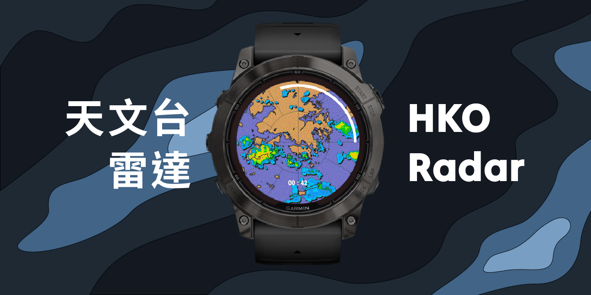

# HKO-Radar

This app obtains the list of latest radar images from the Hong Kong Observatory internal API, then request them sequentially starting from the latest. Results are displayed as a looping animation.

Radar image is the 64km-range version, which is then scaled to fit the screen and cropped centrally.

Pressing Start/Stop will Pause/Unpause the animation.

Only tested to work on the Fenix 7.
